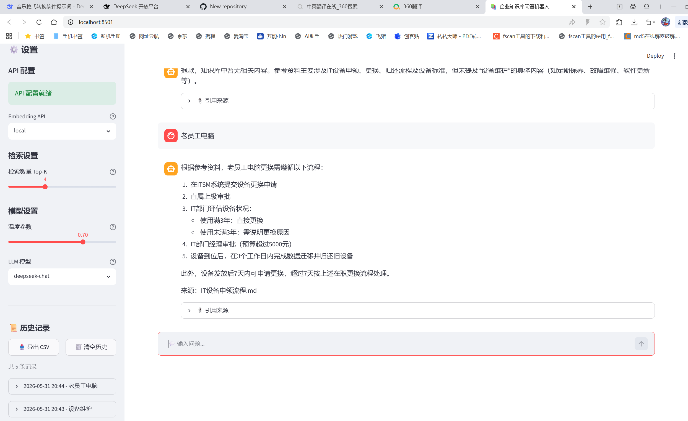
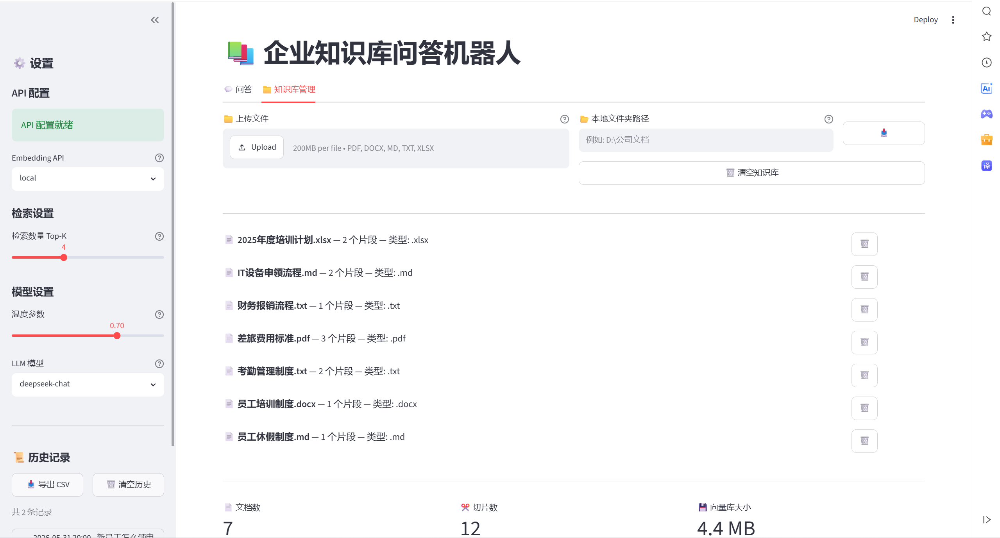

# 企业知识库问答机器人

基于 **RAG（检索增强生成）** 架构的企业知识库智能问答系统。支持多模态文档（文本、图片、视频）上传，通过自然语言提问获取精准回答，并提供 Web 界面、REST API 及 Docker 部署方案。

## 项目目标

1. **知识库构建** — 支持 PDF/Word/Markdown/Excel/图片/视频等多格式文档的结构化存储与语义检索
2. **智能问答** — 基于 DeepSeek 大模型，结合检索到的知识上下文，生成准确、有来源追溯的回答
3. **多模态支持** — 图片通过视觉模型（VL）理解内容，视频通过语音识别（Whisper）转录为文本后纳入知识库
4. **API 服务化** — 提供 FastAPI RESTful 接口，支持移动端及第三方系统集成
5. **容器化部署** — Docker Compose 一键部署，适配云平台

## 技术架构

| 层级 | 技术栈 |
|------|--------|
| **前端 GUI** | Streamlit（Web 界面，响应式布局） |
| **API 层** | FastAPI（RESTful，CORS 跨域支持） |
| **大语言模型** | DeepSeek（deepseek-chat / deepseek-coder） |
| **视觉模型** | DeepSeek VL（图片内容理解） |
| **语音识别** | OpenAI Whisper（视频音频转录） |
| **向量数据库** | ChromaDB（语义检索，cosine 相似度） |
| **Embedding** | BGE / OpenAI / DashScope（三种可选） |
| **文本分割** | LangChain RecursiveCharacterTextSplitter |
| **部署** | Docker + Docker Compose |

```
用户提问 → Embedding 向量化 → ChromaDB 语义检索 → 拼接上下文 → DeepSeek 生成回答
                                   ↑
                    文档/图片/视频 → 多模态处理 → 文本分块 → 向量嵌入 → 存入向量库
```

## 快速开始

### 1. 环境准备

```bash
git clone <repo-url>
cd kb-qa-robot
pip install -r requirements.txt
```

### 2. 配置 API Key

```bash
cp .env.example .env
```

编辑 `.env`：

```env
DEEPSEEK_API_KEY=你的DeepSeek密钥
EMBEDDING_API_TYPE=local          # local / openai / dashscope
```

- `local`：首次自动下载 `BAAI/bge-small-zh-v1.5` 模型
- `openai`：需配置 `OPENAI_API_KEY`
- `dashscope`：需配置 `DASHSCOPE_API_KEY`

### 3. 启动应用

**Web 界面：**

```bash
python run_app.py
# 浏览器访问 http://localhost:8501
```

**API 服务：**

```bash
python run_api.py
# Swagger 文档 http://localhost:8000/docs
```

### 4. Docker 部署

```bash
docker compose up -d
# Streamlit → http://localhost:8501
# API       → http://localhost:8000
```

## API 文档

| 端点 | 方法 | 说明 |
|------|------|------|
| `/health` | GET | 健康检查 |
| `/chat` | POST | RAG 问答 |
| `/search` | POST | 语义检索（仅返回片段） |
| `/upload` | POST | 上传文档（multipart/form-data） |
| `/stats` | GET | 知识库统计 |
| `/documents` | GET | 文档列表 |
| `/documents/{source}` | DELETE | 删除指定文档 |
| `/collection` | DELETE | 清空知识库 |

### 示例

```bash
# 问答
curl -X POST http://localhost:8000/chat \
  -H "Content-Type: application/json" \
  -d '{"question": "公司的考勤制度是什么？", "top_k": 4}'

# 上传文件
curl -X POST http://localhost:8000/upload \
  -F "files=@文档.pdf" \
  -F "files=@照片.jpg"

# 检索
curl -X POST http://localhost:8000/search \
  -H "Content-Type: application/json" \
  -d '{"query": "报销流程", "top_k": 5}'
```

## 项目结构

```
├── app.py                        # Streamlit 主应用
├── api.py                        # FastAPI 后端
├── run_app.py                    # 启动脚本
├── config.py                     # 配置管理
├── requirements.txt              # Python 依赖
├── Dockerfile                    # Docker 镜像
├── docker-compose.yml            # Docker 编排
├── core/                         # 核心模块
│   ├── document_loader.py        # 文档加载（含图片/视频）
│   ├── multimodal_processor.py   # 多模态处理（VL + Whisper）
│   ├── embedding_client.py       # 向量化客户端
│   ├── llm_client.py             # DeepSeek LLM 客户端
│   ├── retriever.py              # 检索器
│   ├── text_splitter.py          # 文本分割
│   └── vector_store.py           # Chroma 向量存储
├── utils/                        # 工具函数
│   ├── helpers.py
│   └── history_manager.py
├── data/                         # 运行时数据
│   ├── chroma_db/                # 向量数据库
│   └── documents/                # 上传的文档
└── tests/                        # 测试文档
```

## 支持的导入格式

| 格式 | 处理方式 |
|------|----------|
| PDF | 直接文本提取 |
| DOCX | 直接文本提取 |
| MD / TXT | 直接读取 |
| XLSX | 表格转文本 |
| JPG / PNG | 视觉模型（DeepSeek VL）理解 → 文字描述 |
| MP4 | 音频提取 → Whisper 语音识别 → 文字转录 |

## 团队成员

| 姓名 | 学号 | 角色 | 职责 |
|------|------|------|------|
| （填写） | （填写） | 组长 | 项目统筹、RAG 核心开发 |
| （填写） | （填写） | 组员 | 多模态模块、API 开发 |
| （填写） | （填写） | 组员 | 前端界面、Docker 部署 |
| （填写） | （填写） | 组员 | 测试文档、PPT/报告 |

## 界面展示

### 问答界面


### 知识库管理


## License

本项目仅用于课程大作业和学习目的。
